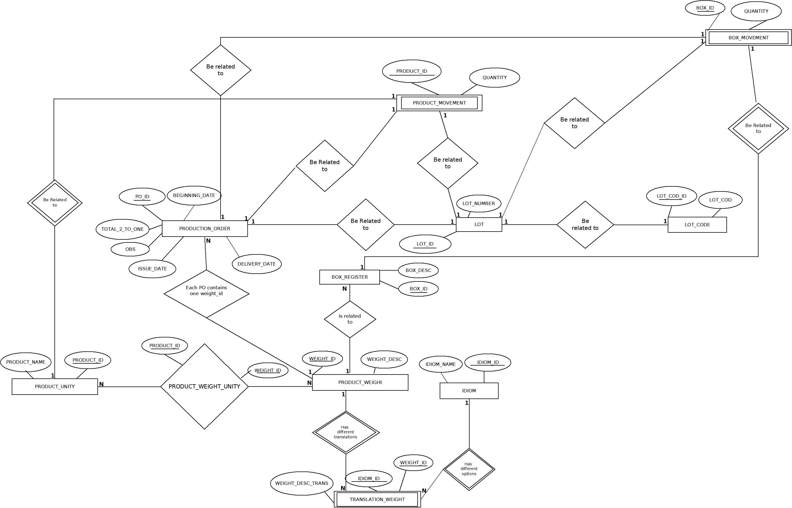

<!-- a largura é 100%, pois representa a proporção completa da faixa superior do paragrafo -->
    

    
<!-- Usei barra antes do "p" para fechar paragrafo -->
<h1 id = "projectDescription" align="center">Production Order Data Base</h1>

This project reproduce what already happens in the company that I currently work for. I realized that some sheets that I have to deal with are basically a database - You can even identify the primary and foreign keys playing their roles. I decided to build a low-scale database inspired in this process that contains the same data presented in the sheets and the relationships between the tables. 

## Content Table

<ul>
    <li><a href = "#context">General Context</a></li>
    <li><a href = "#databasedesign">Database Design</a><ul>
    <li><a href = "#relationships">Critical relationships</a></li></ul></li>
    <li><a href = "#Technologies">Technologies Used</a></li>
</ul>

 
<h2 id="context"> General Context </h2>

The Fini Company is a Spanish company that manufactures candies. There's a Brazilian branch where I work.

I would like to define what Production Order stands for: Whenever, a product request is made, a sheet is generated with all information the machine operator needs, this includes requesting supplies from the logistic department, guiding the operator to label the packaging and knowing how much needs to be produced. 

In my experience at the factory, I realized that a production order sheet, generated by the ERP system Protheus, is formed by the relationships between multiple tables.

 

<h2 id="databasedesign">The Database Design</h2>

The database design is based on the relationships between the entities involved in the production order workflow. Since the production order itself is not organized as a database, it was necessary to identify all the entities related to the workflow and ensure that the structure has proper connections to better represent the business rules and preserve cohesion.

The following image represents the Entity Relationship Diagram (ERD) of the structure:   

The following model represents the Entity Relationship Model (ERM):
    
    PRODUCTION_ORDER(Po_id[PK], Issue_Date, Beginning_date, Delivery_date, Total_2_To_One, OBS, Lot_id[FK], Weight_id[FK])

    PRODUCT_UNITY(Product_id[PK], product_name) 

    PRODUCT_WEIGHT_UNITY(Product_id[PK and FK], Weight_id[PK and FK]) 

    PRODUCT_WEIGHT(Weight_id[PK], Box_id[FK], Weight_desc)

    TRANSLATION_WEIGHT(Weight_id[PK and FK], Idiom_id[PK and FK], Weight_desc_trans)

    IDIOM(Idiom_id[PK], Idiom_name)

    BOX_REGISTER(Box_id[PK], Box_desc) 	

    LOT(Lot_id[PK], Lot_cod_id[FK], Lot_number) 

    LOT_CODE(Lot_cod_id[PK], Lot_cod) 

    ITEM_MOVEMENT(Item_movem_id[PK], Movement_id[PK], Quantity, Product_id[FK], Box_id[FK], Lot_id[FK], Po_id[FK])
 

 <h3 id="relationships"> Critical relationships</h3>
 
As I mentioned earlier, the sheets were not organized as a database, which means that there is redundant  information. It was necessary to identify the entities and ensure that at least the third normal form (3NF) was applied. 

1.[PRODUCT_UNITY] N:N [PRODUCT_WEIGHT]:
 

    PRODUCT_UNITY(Product_id[PK], product_name) 

    PRODUCT_WEIGHT_UNITY(Product_id[PK and FK], Weight_id[PK and FK]) 

    PRODUCT_WEIGHT(Weight_id[PK] ,Box_id[FK], Weight_desc)   
The table PRODUCT_UNITY is responsible for storing all the types of candy that the factory manufactured. The PRODUCT_WEIGHT is reponsible to associating one product (or a collection of products) with its respective packaging.  Since, one product - or more than one - can be associated with multiple packaging options - and multiple packaging options also can be associated with more than products, it was necessary to create a associative table (PRODUCT_WEIGHT_UNITY) to ensure that all combinations are possible 
 
 
2.[PRODUCT_WEIGHT] 1:N [BOX_REGISTER]

    PRODUCT_WEIGHT(Weight_id[PK] ,Box_id[FK], Weight_desc)

    BOX_REGISTER(Box_id[PK], Box_desc) 	
The PRODUCT_WEIGHT is also responsible for associating products with their respective packaging. Since the same packaging can be related to mutiple "weight_id" and each "weight_id" can only be associated with one packaging, the primary key of the BOX_REGISTER table is referenced in the PRODUCT_WEIGHT table as foreign key.
 
 
3.[LOT] N:1 [LOT_CODE]

    LOT(Lot_id[PK], Lot_number[PK],  Lot_cod_id[FK]) 

    LOT_CODE(Lot_cod_id[PK], Lot_cod)
    
Products are organized into categories and the LOT table reflects this rule. The LOT_CODE table is responsible for storing these categories. Since each "Lot_id" can belong to only one category the primary key of the LOT_CODE table is referenced in the LOT table as a foreign key. 
 
 
4.[PRODUCTION_ORDER] 1:1 [ITEM_MOVEMENT]

    PRODUCTION_ORDER(Po_id[PK], Issue_Date, Beginning_date, Delivery_date, Total_2_To_One, OBS, Lot_id[FK], Weight_id[FK])

    ITEM_MOVEMENT(Item_movem_id[PK], Movement_id[PK], Quantity, Product_id[FK],Box_id[FK], Lot_id[FK], Po_id[FK])
The table ITEM_MOVEMENT is responsible for storing the data that the machine operator needs to request items from the logistics department. The primary key of the ITEM_MOVEMENT is formed by two fields to ensure that each individual movement (Item_movem_id) can be associated with one Movement_id. 
  
Since only one production order can be associated with one logistics movement, the primary key from the PRODUCTION_ORDER table is referenced in the ITEM_MOVEMENT table.

 
<h2 id="Technologies">Technologies Used</h2>
<ul>
<li>SQL Server Management Studio 20.2: Used for designing, querying, and managing the database.</li>
<li>Dia: A diagramming tool used to model the Entity-Relationship Diagram (ERD).</li>

</ul>
